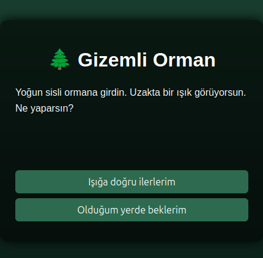

# TR
# Gizemli Orman — Hikaye Oyunu
JavaScript ile geliştirilmiş, seçime dayalı interaktif bir metin macera oyunu. Oyuncu 6 soru boyunca verdiği cevaplara göre üç farklı sondan birini alır.

[Canlı Önizleme](https://dursunkokturk.github.io/JavaScript-Project-Story-Game)

## Oynanış

- Her sahnede oyuncuya bir durum ve 2 seçenek sunulur
- Seçimler arka planda "cesaret puanı" olarak takip edilir
- 6 soru tamamlandığında puana göre üç farklı son gösterilir
- Yeniden Başla butonu ile oyun sıfırlanır

## Sonuç Tablosu

| Cesaret Puanı | Son                                       |
| ------------- |-------------------------------------------|
| 4 veya üzeri  | Ormanın koruyucusu olursun                |
| 2 – 3         | Ormandan sağ çıkarsın, sır çözümsüz kalır |
| 0 – 1         | Korkuların seni geri adım attırır         |

## Özellikler

- 6 Sorulu Dal Yapısı — Her soru bağımsız olup ortak bir puan sistemine katkıda bulunur
- 3 Farklı Son — Cesaret puanı eşiklerine göre belirlenir
- Yeniden Oynama — Tek butonla tüm state sıfırlanır
- Sade DOM Yönetimi — Framework kullanılmadan saf JavaScript

## Teknolojiler

| Teknoloji        | Açıklama                                            |
| ---------------- |-----------------------------------------------------|
| HTML5            | Sayfa iskeleti                                      |
| CSS3             | Orman temalı gradyan arka plan, hover animasyonları |
| JavaScript (ES6) | Oyun mantığı, dinamik DOM güncellemeleri            |

📁 Proje Yapısı
story-game/  
├── index.html  
└── assets/  
    ├── css/  
    │   └── style.css  
    └── js/  
        └── story-game.js  

## Kurulum
Bağımlılık yoktur. Doğrudan tarayıcıda açılır.
bash# Repoyu klonlayın
git clone https://github.com/kullanici-adi/story-game.git

### Proje klasörüne girin
cd story-game

### index.html dosyasını tarayıcıda açın
open index.html

## Tasarım Detayları

- Arka Plan: #1b4332 → #081c15 dikey gradyan (koyu orman teması)
- Kart: rgba(0,0,0,0.6) yarı saydam, border-radius: 12px
- Butonlar: #2d6a4f arka plan, hover'da #40916c'ye geçiş
- Yeniden Başla Butonu: #d00000 kırmızı vurgu
- Font: Arial, sans-serif

# EN
# Mysterious Forest — Story Game
An interactive text adventure game built with JavaScript, based on choices. The player receives one of three different endings based on their answers across 6 questions.

## Gameplay

- Each scene presents the player with a situation and 2 options
- Choices are tracked in the background as a "courage score"
- After 6 questions, one of three endings is shown based on the score
- The game resets with the Restart button

## Outcome Table

| Courage Score | Ending                                              |
| ------------- |-----------------------------------------------------|
| 4 or above    | You become the guardian of the forest               |
| 2 – 3         | You escape the forest, the mystery remains unsolved |
| 0 – 1         | Your fears force you to take a step back            |

## Features

- 6-Question Branch Structure — Each question is independent and contributes to a shared scoring system
- 3 Different Endings — Determined by courage score thresholds
- Replay — All state resets with a single button
- Clean DOM Management — Pure JavaScript with no framework

## Technologies

| Technology       | Description                                         |
| ---------------- |-----------------------------------------------------|
| HTML5            | Page structure                                      |
| CSS3             | Forest-themed gradient background, hover animations |
| JavaScript (ES6) | Game logic, dynamic DOM updates                     |

## Project Structure
story-game/  
├── index.html  
└── assets/  
    ├── css/  
    │   └── style.css  
    └── js/  
        └── story-game.js  

## Installation
No dependencies. Opens directly in the browser.
bash# Clone the repo
git clone https://github.com/username/story-game.git

### Navigate to the project folder
cd story-game

### Open index.html in the browser
open index.html

## Design Details

- Background: #1b4332 → #081c15 vertical gradient (dark forest theme)
- Card: rgba(0,0,0,0.6) semi-transparent, border-radius: 12px
- Buttons: #2d6a4f background, transitions to #40916c on hover
- Restart Button: #d00000 red accent
- Font: Arial, sans-serif
